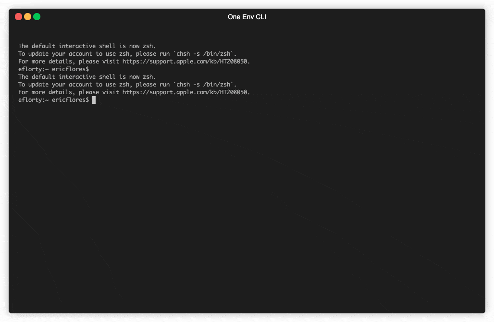

# One-Env-CLI

One-Env-CLI is a command-line tool that streamlines environment creation using your password manager as the provider. It provides a convenient way to manage and create environments, such as Postman environments, quickly and securely.

## Installation

### Using Homebrew

You can use [Homebrew](https://brew.sh/) (on macOS or Linux) to install one-env-cli.

Run the following command to install the tool:

```
brew tap ericflores108/tap
```
```
brew install one-env-cli
```
## Usage

To use One-Env-CLI, run the following command:

```
one-env-cli [command] [flags]
```

### Available Commands

- `add`: Add a 1Password item to an integrated application.
  - `postman`: Add a 1Password item to create a Postman environment.

### Flags

- `-i, --item`: Specify the item name to add.
- `-v, --verbose`: Enable verbose output.

## Configuration

One-Env-CLI uses a configuration file to store settings. The default configuration file is located at `~/.one-env-cli` and is in JSON format.

## Demo



### Default Configuration

The default configuration file looks like this:

```json
{
  "plugin": {
    "postman": {
      "keyName": "Postman",
      "keySecretName": "api-key"
    }
  },
  "op": {
    "vault": "Developer"
  },
  "cli": {
    "logging": {
      "level": "debug",
      "encoding": "json",
      "outputPaths": [
        "tmp/log/one-env-cli.json"
      ]
    }
  }
}
```

You can modify the configuration file to suit your needs. The available options are:

- `plugin.postman.keyName`: The name of the 1Password item that contains the Postman API key.
- `plugin.postman.keySecretName`: The name of the secret field within the 1Password item that holds the Postman API key.
- `op.vault`: The name of the 1Password vault to use.
- `cli.logging.level`: The logging level (e.g., "debug", "info", "error").
- `cli.logging.encoding`: The encoding format for the log files (e.g., "json").
- `cli.logging.outputPaths`: An array of file paths where the logs will be written.

### Custom Configuration (Work in Progress)

The `config` command for setting up custom configuration is currently under development and will be available in a future release.

## Example

Here's an example of how to use One-Env-CLI to create a Postman environment:

```
one-env-cli add postman -i Strava
```

This command will retrieve the specified 1Password item, transform it into a Postman environment, and create the environment in Postman.

## License

One-Env-CLI is licensed under the [MIT License](LICENSE).

## Contact

If you have any questions or suggestions, feel free to reach out to the maintainer:

- Eric Flores
- Email: eflorty108@gmail.com